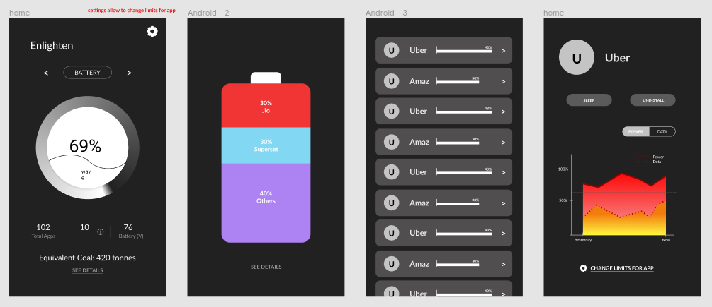

### HCI Project - Enlighten

To run:

- Install Node.js - https://nodejs.org/en/
- Download the source code / clone the repository
- Run `npm install` to install dependencies.
- Run `npm start` to start server.
- Open in browser. Switch to [mobile view](https://chrome.google.com/webstore/detail/mobile-view-switcher/bmhfelbhbkeoldaiphchjibggnoodpcj?hl=en)
